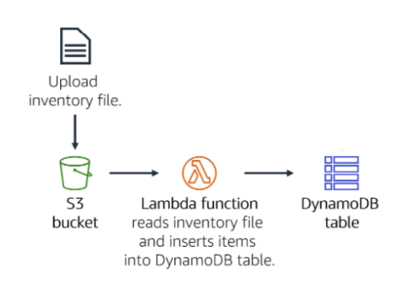
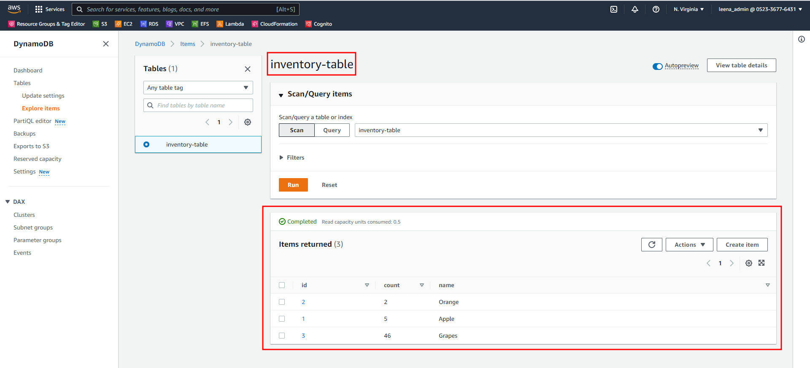

## About the Project
This project demonstrates how to trigger a Lambda function when a file is uploaded to Amazon Simple Storage Service (Amazon S3). The file will be loaded into an Amazon DynamoDB table. The steps followed are as follows:
* You will upload an inventory file to an Amazon S3 bucket.
* This upload will trigger a Lambda function that will read the file and insert items into an Amazon DynamoDB table.

## Architecture
The following architecture diagram depicts the workflow of the entire project from start to end.

## Workflow
When a user uploads an inventory file to the S3 bucket, it triggers a lambda function which reads the data from the csv file and inserts it into the DynamoDB table. 

## Lambda Function Code

## Detailed Configurations
This section explains the configurations that were configured in the following Amazon services.
* Amazon S3 Bucket: In this bucket, we uploaded the csv file which contained the inventory details. Once the file was uploaded, a lambda function had to be triggered based on the notification sent from the s3 events. For this, we added an event notification  (to send to Lambda) to S3 bucket whenever any object (of csv type) was created in the bucket.

Also a test event can be configured as shown below.

While configuring the test event make sure you give the values in event.json correspondingly as shown below

Follow these steps to view logs in cloud watch

* DynamoDB: A DynamoDB table was created which had the following fields; id (used as partition key), item name, item count and store location.  
* Lambda function (triggered on S3 upload): It used Python3 as the runtime environment. Based on the event received from the S3 bucket, this function retrieves the individual item details and uploads it to the DynamoDB table.

## Output
Below we can find the inventory items from the csv file being uploaded to the dynamodb table.

## References
* [Amazon Documentation](https://docs.aws.amazon.com/)

